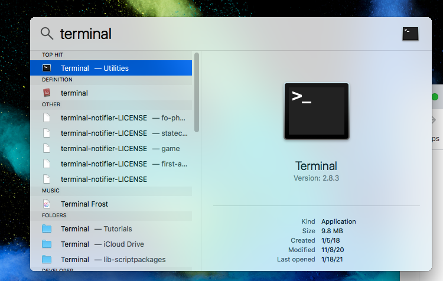
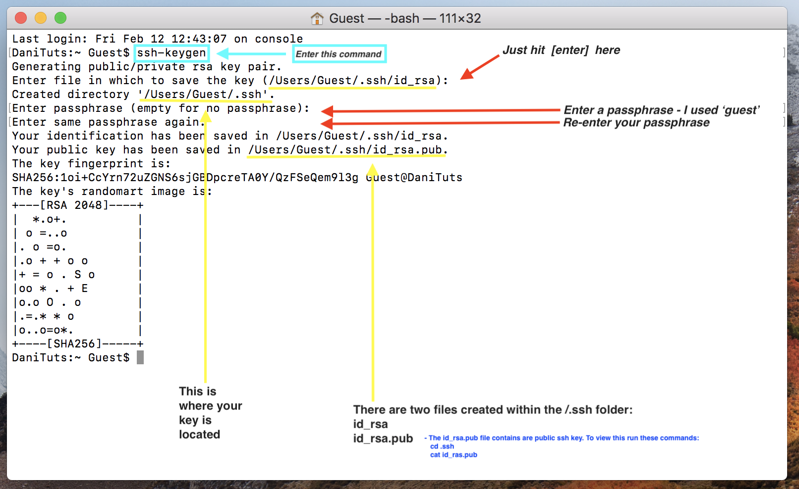

# Create an ssh key
In this section we will create an ssh key. 

## Step 1
Open up your terminal on your computer.

-On a mac: 
* open finder
<p align="left" >

</p>

* go to applications

<p align="left" >

</p>

* open the utilities folder
* click on terminal
<p align="left" >

</p>

...or...

* hit <kbd>command &#8984;</kbd> + <kbd>space bar</kbd> to open spotlight search
* type in "terminal"

<p align="left" >

</p>

.... and Wa-Lah!

<sub><em><sup>*</sup>generally there isn't a shorcut to do this unless it's set up with in your keyboard shortcuts
</em></sub>

Here is an example of what your computer terminal looks like:<br>
<sub><em><sup>*</sup>this is not to be confused with your terminal in your editor but you could potentially use that instead</em></sub>

<p align="left">

</p>

## Step 2 - Create the ssh key (aka. RSA key pair)
Enter in the command line of your terminal
```bash
ssh-keygen
```

The above command will create what's known as RSA key pair represented in 2048-bit encryption. 

<sub><em><sup>*</sup>alternatively, you can enter `ssh-keygen -b 4096` in order to create a 4096-bit encryption for your key.</em></sub>

Expected Output:
---------------
```
Generating public/private rsa key pair.
Enter file in which to save the key (/your_computer/.ssh/id_rsa):
```

This will give you the option of where you would like to save your ssh key, or if you hit enter, it will default to creating this folder `/your_computer/.ssh/id_rsa` (as expected in the Output) and store it there.

If you already have and ssh key that's been previously generated and you attempt to create a another (knowingly or unkowingly), then this will be the expected Output:

Expected Output:
---------------
```
Generating public/private rsa key pair.
/computer/your_computer/.ssh/id_rsa already exists.
Overwrite (y/n)?
```
This will then give you the option to replace the old ssh key with the new one or create another ssh key entirely. 

<sub><em><sup>*</sup> This happened to me and I hit `y` because it's too difficult to keep track of too many ssh keys. However, you may need or want multiple ssh keys for each project and or service you are entering remotely via the command line</em></sub>

Once your key is created the system will generate a folder labeled /.ssh. This won't be visible in the finder and you will want to use the terminal to `cd` into the folder. Within the folder there will be 2 files created:
```
/computer/your_computer/.ssh/id_rsa
/computer/your_computer/.ssh/id_rsa.pub
```
To view your ssh key enter `cd` into the .ssh folder and enter `cat id_rsa.pub` to view your encrypted key. You'll want to copy this temporarily into your clipboard to use later.

#### Below is an example of what this looks like in the terminal
<p align="center" >

</p>

Lastly! ... Finally.. here is what you should expect your key to look like (not exactly of course):

```
ssh-rsa AAAAB3NzaC1yc2EAAAABIwAAAQEAklOUpkDHrfHY17SbrmTIpNLTGK9Tjom/BWDSU
GPl+nafzlHDTYW7hdI4yZ5ew18JH4JW9jbhUFrviQzM7xlELEVf4h9lFX5QVkbPppSwg0cda3
Pbv7kOdJ/MTyBlWXFCR+HAo3FXRitBqxiX1nKhXpHAZsMciLq8V6RjsNAQwdsdMFvSlVK/7XA
t3FaoJoAsncM1Q9x5+3V0Ww68/eIFmb1zuUFljQJKprrX88XypNDvjYNby6vw/Pb0rwert/En
mZ+AW4OZPnTPI89ZPmVMLuayrD2cE86Z/il8b+gw3r3+1nKatmIkjn2so1d01QraTlMqVSsbx
NrRFi9wrf+M7Q== guest@mylaptop.local
```


## [...To the next step...](https://github.com/DanielTisue/Application-Deployment_DigitalOcean/blob/master/Step_2-Create-Droplet/Create-Droplet-Use-SSH.md)


