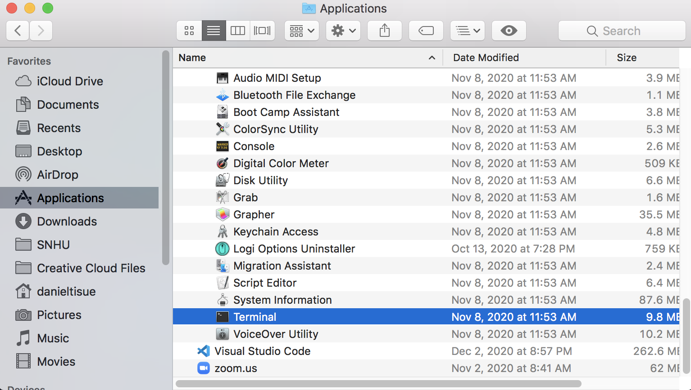
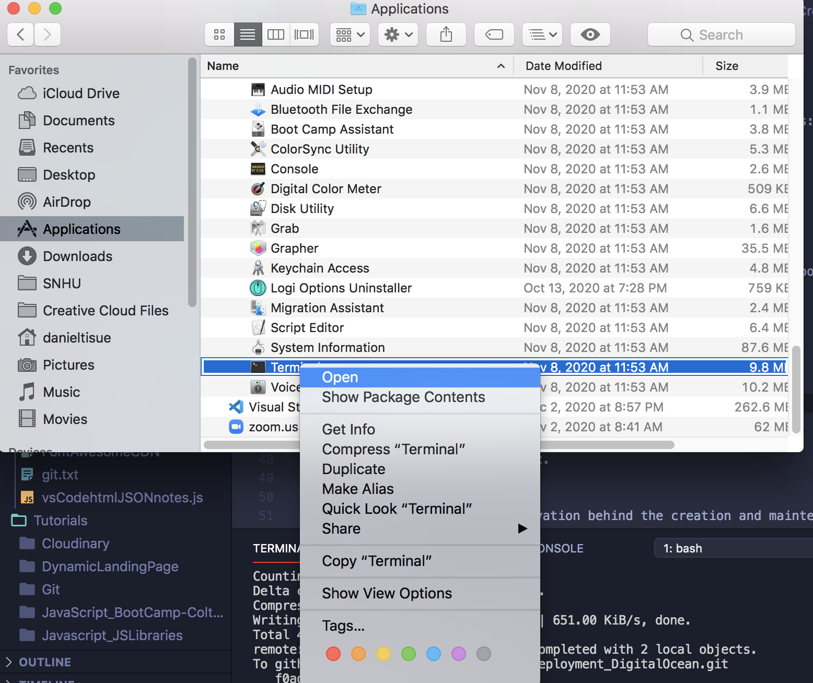

# Create an ssh key
In this section we will create an ssh key. 

## Step 1
Open up your terminal on your computer.

-On a mac: 
* open finder
* go to applications
* open the utilities folder
* click on terminal

...or...

* hit <kbd>command &#8984;</kbd> + <kbd>space bar</kbd> to open spotlight search
* type in "terminal"

.... and Wa-Lah!

*generally there isn't a shorcut to do this unless it's set up with in your keuyboard shortcuts

## Screenshots

## Step 2
A short description of the motivation behind the creation and maintenance of the project. This should explain **why** the project exists.

## Screenshots
Include logo/demo screenshot etc.

## Step 3
A short description of the motivation behind the creation and maintenance of the project. This should explain **why** the project exists.

## Screenshots
Include logo/demo screenshot etc.

## Step 4
A short description of the motivation behind the creation and maintenance of the project. This should explain **why** the project exists.

## Screenshots
Include logo/demo screenshot etc.

### Why use it?
If people like your project they’ll want to learn how they can use it. To do so include step by step guide to use your project.

### Background
Give proper credits. This could be a link to any repo which inspired you to build this project, any blogposts or links to people who contrbuted in this project. 

#### Anything else that seems useful

