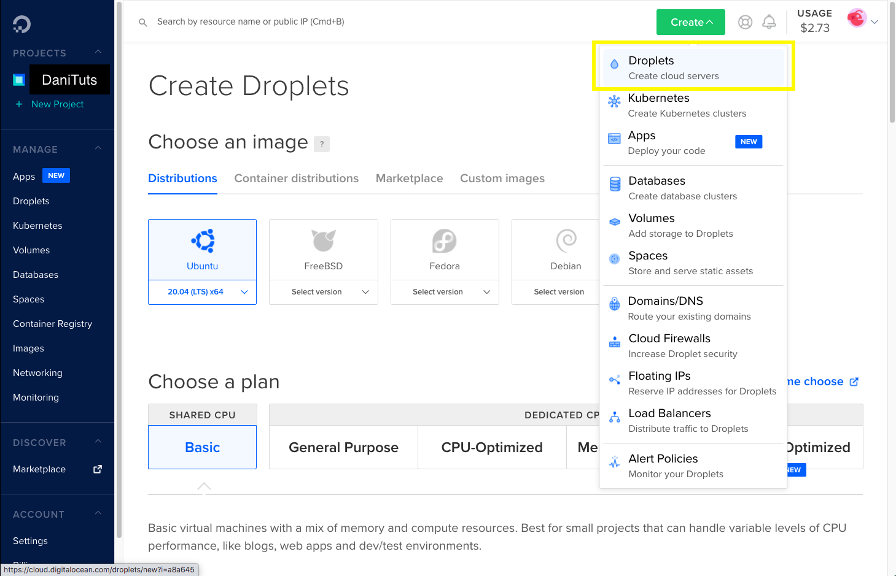
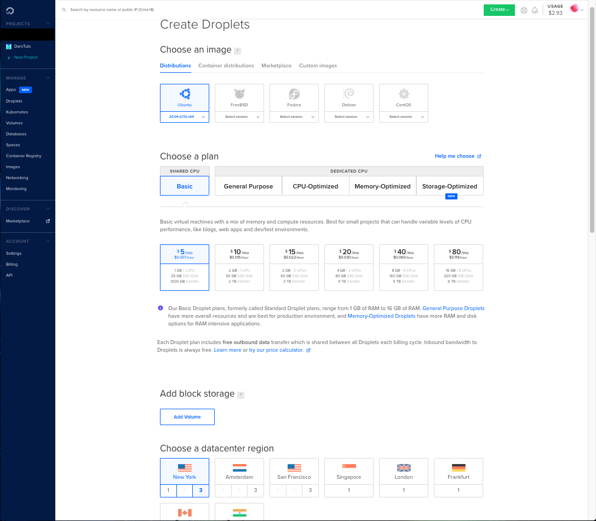

# Step 2 - Creating a Droplet
In this step we will be creating a droplet, adding our project, and installing the necessary packages for our project.

##  Login into Digital Ocean or Create an account

Click here [https://www.digitalocean.com/](https://www.digitalocean.com/) to get to their websit.

* If you do not have an account then create one.
* at the top right of the screen click <button>Create &#8964;</button> button.
* You should see this menu.

<p align="left" >

</p>

* Once you click this, you will then be brought to a page to set up your Droplet (virtual server).
* See below: 
<p align="left" >

</p>

* This is a basic application that I don't expect to get loads of traffic for in the beginning. For that reason, I am choosing the shared CPU basic plan at $5.00 a month. 

<sub><em><sup>*</sup>You can always scale and upgrade to a higher plan later if needed.</em></sub> 

<p align="left" >
IMAGE
</p>

* For this project we will choose NYC as our datacenter site. 

<p align="left" >
IMAGE
</p>

<sub><em><sup>*</sup>Generally you want to choose a datacenter that will be close to the market your site is intended for. However, the needs of your app may also dictate where your datacenter should be located. See here [Regional Availability Matrix](https://www.digitalocean.com/docs/platform/availability-matrix/) for datacenters capability. There isn't much reason to overthink this!</em></sub>  

* Next is our Authentication method. We will be using SSH keys....

##  Adding your SSH key to your droplet

<p align="left" >
IMAGE
</p>

* Open your terminal and enter into your `/computer/your_computer/.ssh/id_rsa.pub` file. The important thing is to find where you are in your file system and `cd`  .ssh folder. Then hit `cat id_rsa.pub` to see your ssh key. 
* Copy the key only. It should look like this:
```
ssh-rsa AAAAB3NzaC1yc2EAAAABIwAAAQEAklOUpkDHrfHY17SbrmTIpNLTGK9Tjom/BWDSU
GPl+nafzlHDTYW7hdI4yZ5ew18JH4JW9jbhUFrviQzM7xlELEVf4h9lFX5QVkbPppSwg0cda3
Pbv7kOdJ/MTyBlWXFCR+HAo3FXRitBqxiX1nKhXpHAZsMciLq8V6RjsNAQwdsdMFvSlVK/7XA
t3FaoJoAsncM1Q9x5+3V0Ww68/eIFmb1zuUFljQJKprrX88XypNDvjYNby6vw/Pb0rwert/En
mZ+AW4OZPnTPI89ZPmVMLuayrD2cE86Z/il8b+gw3r3+1nKatmIkjn2so1d01QraTlMqVSsbx
NrRFi9wrf+M7Q==
```
<sub><em><sup>*</sup> depending on where you are in your file system in the terminal you can also paste this</em> `cat ~/.ssh/id_rsa.pub` <em>into your command line to view your key</em><sub>

* Go back to the digital ocean browser window and hit <button>New SSH key</button>. 

<p align="left" >
IMAGE
</p>

* Paste your SSH key into popup modal. See below:

<p align="left" >
IMAGE
</p>


#-----------------------------------------
## Step 2 - Create the ssh key (aka. RSA key pair)

* If you do not have an account then create one.
* at the top right of the screen click <button>Create &#8964;</button> button.
* You should see this menu.

#-----------------------------------------
The above command will create what's known as RSA key pair represented in 2048-bit encryption. 

<sub><em><sup>*</sup>alternatively, you can enter</em> `ssh-keygen -b 4096` <em>in order to create a 4096-bit encryption for your key.</em></sub>

Expected Output:<br>
&ndash;&nbsp;&ndash;&nbsp;&ndash;&nbsp;&ndash;&nbsp;&ndash;&nbsp;&ndash;&nbsp;&ndash;&nbsp;&ndash;&nbsp;&ndash;&nbsp;&ndash;&nbsp;&ndash;&nbsp;&ndash;
```
Generating public/private rsa key pair.
Enter file in which to save the key (/your_computer/.ssh/id_rsa):
```

This will give you the option of where you would like to save your ssh key, or if you hit enter, it will default to creating this folder `/your_computer/.ssh/id_rsa` (as expected in the Output) and store it there.

If you already have and ssh key that's been previously generated and you attempt to create a another (knowingly or unkowingly), then this will be the expected Output:

Expected Output:<br>
&ndash;&nbsp;&ndash;&nbsp;&ndash;&nbsp;&ndash;&nbsp;&ndash;&nbsp;&ndash;&nbsp;&ndash;&nbsp;&ndash;&nbsp;&ndash;&nbsp;&ndash;&nbsp;&ndash;&nbsp;&ndash;
```
Generating public/private rsa key pair.
/computer/your_computer/.ssh/id_rsa already exists.
Overwrite (y/n)?
```
This will then give you the option to replace the old ssh key with the new one or create another ssh key entirely. 

<sub><em><sup>*</sup> This happened to me and I hit</em> `y` <em>because it's too difficult to keep track of too many ssh keys. However, you may need or want multiple ssh keys for each project and or service you are entering remotely via the command line</em></sub>

Once your key is created the system will generate a folder labeled /.ssh. This won't be visible in the finder and you will want to use the terminal to `cd` into the folder. Within the folder there will be 2 files created:
```
/computer/your_computer/.ssh/id_rsa
/computer/your_computer/.ssh/id_rsa.pub
```
To view your ssh key enter `cd` into the .ssh folder and enter `cat id_rsa.pub` to view your encrypted key. You'll want to copy this temporarily into your clipboard to use later.

#### Below is an example of what this looks like in the terminal
<p align="center" >

</p>

Lastly! ... Finally.. here is what you should expect your key to look like (not exactly of course):

```
ssh-rsa AAAAB3NzaC1yc2EAAAABIwAAAQEAklOUpkDHrfHY17SbrmTIpNLTGK9Tjom/BWDSU
GPl+nafzlHDTYW7hdI4yZ5ew18JH4JW9jbhUFrviQzM7xlELEVf4h9lFX5QVkbPppSwg0cda3
Pbv7kOdJ/MTyBlWXFCR+HAo3FXRitBqxiX1nKhXpHAZsMciLq8V6RjsNAQwdsdMFvSlVK/7XA
t3FaoJoAsncM1Q9x5+3V0Ww68/eIFmb1zuUFljQJKprrX88XypNDvjYNby6vw/Pb0rwert/En
mZ+AW4OZPnTPI89ZPmVMLuayrD2cE86Z/il8b+gw3r3+1nKatmIkjn2so1d01QraTlMqVSsbx
NrRFi9wrf+M7Q== guest@mylaptop.local
```


## [...To the next step...](https://github.com/DanielTisue/Application-Deployment_DigitalOcean/blob/master/Step_2-Create-Droplet/Create-Droplet-Use-SSH.md)


